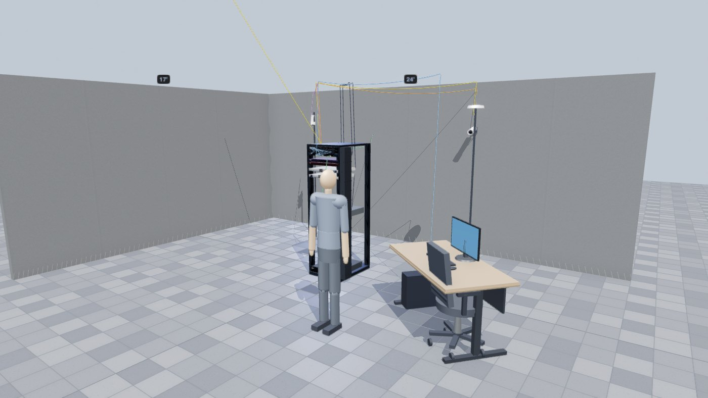
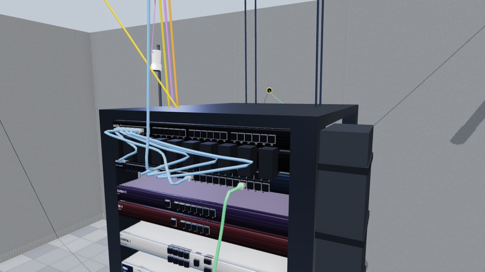
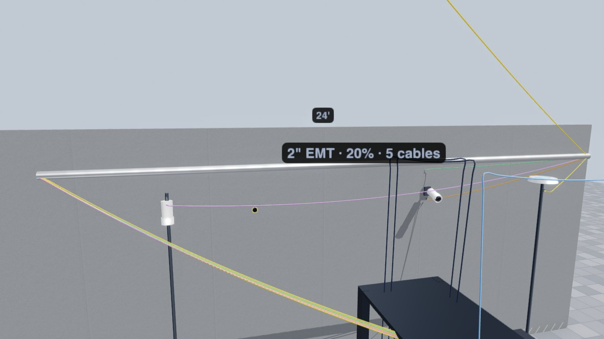
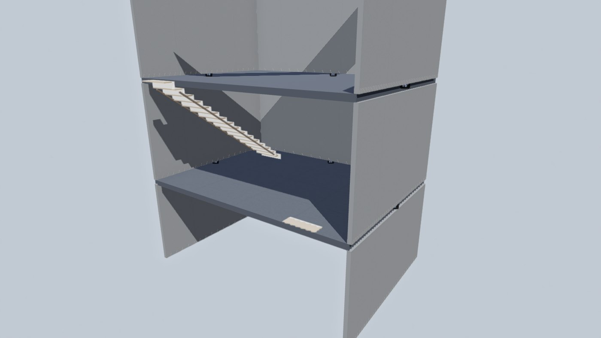

# NetMap3D

3D network design at 1:1 scale. Draw the building, run the cable through it, take the model to site.



## Run it

Download [`NetMap3D.html`](NetMap3D.html) and open it. One file, ~1 MB, everything inlined. No install, works offline.

(Use GitHub's **Download raw file** button. The Raw link opens it as text.)

From source:

```bash
npm install
npm start                # Electron
npx serve .              # or any browser
node build-portable.js   # regenerate NetMap3D.html
```

## Tools

Orbit drag, pan right-drag, zoom scroll. Walk (V) is first-person WASD, Space jumps, F flies.

| | |
|---|---|
| **Cable** (C) | Click port, route via managers / holes / raceways, click destination. Runs over 5 ft auto-route through the plenum. |
| **Tie** (T) | Straps nearby cables into a hex-packed bundle. |
| **Wall / Room / Floor** | Structure on the active level. Room adds four walls and a ceiling at that storey's clear height. |
| **Stairs** | Flight up to the deck above. Walkable, collidable. IRC R311.7 rise and run. |
| **Drill** (H) | Pass-through at preset or custom size, ⅛"–12". |
| **Raceway** | EMT ½"–4", tray, surface raceway, J-hooks. Fill tracked to NEC Ch. 9 Table 4. |
| **Measure** (M) | ft/in between two points. |
| **2D Plan** | Logical view. Planned links go solid once cabled in 3D. |

Levels: `[` and `]` change storey, `\` shows all. Basement, crawlspace, ground, upper floors, attic. Storeys above the active one hide so you can see in. Below-grade storeys excavate.

Save/Load is JSON. Export CSV gives the cable schedule with IPs, panel face, colour, length, plus device inventory.





## Roadmap

- [x] Collision-aware cable routing
- [x] Patch panel front/rear as separate jacks
- [x] Levels, basements, crawlspaces, attics, stairs
- [x] Conduit and raceway with NEC fill
- [ ] 1:1 device port layouts from spec sheets
- [ ] Simulation: MAC/ARP, L2 forwarding, VLANs, routing, DHCP, CLI
- [ ] Wider device catalog
- [ ] Video walkthrough to building model
- [ ] Multi-user collaboration

## Notes for contributors

`state` is plain JSON (`racks[]`, `devices[]`, `cables[]`, `walls[]`, `slabs[]`, `stairs[]`, `raceways[]`). It's the save format. Everything 3D rebuilds from it, so edit state then rebuild.

A cable endpoint is `(device, port, side)`, not `(device, port)`. `side` is `front` or `rear`, and capacity is per jack. Old saves migrate in `migrateCableSides`.

Routing precedence: raceway > hand-placed waypoints > auto-route.

`settleCable` applies droop, pushes samples out of walls, racks, gear and furniture, and separates each run from every other settled route. Ties and raceway spans are exempt, since cables touch inside a strap or conduit.

Colliders derive from each solid mesh's geometry bounding box, so new catalog items are collidable for free.

The composer target must stay multisampled. The default target bypasses the canvas `antialias` flag and wrecks thin geometry like cat6.

Adding a tool: button goes in `#modescroll`, options in `#optbar` with `data-for="<mode>"`. Don't add to the right-hand cluster.

`NetMap3D.html` is committed and rebuilt by a pre-commit hook when `app.js`, `index.html` or `style.css` change. Building elsewhere, run `node build-portable.js` first.

Pinned to `three@0.147` (UMD, no bundler).
